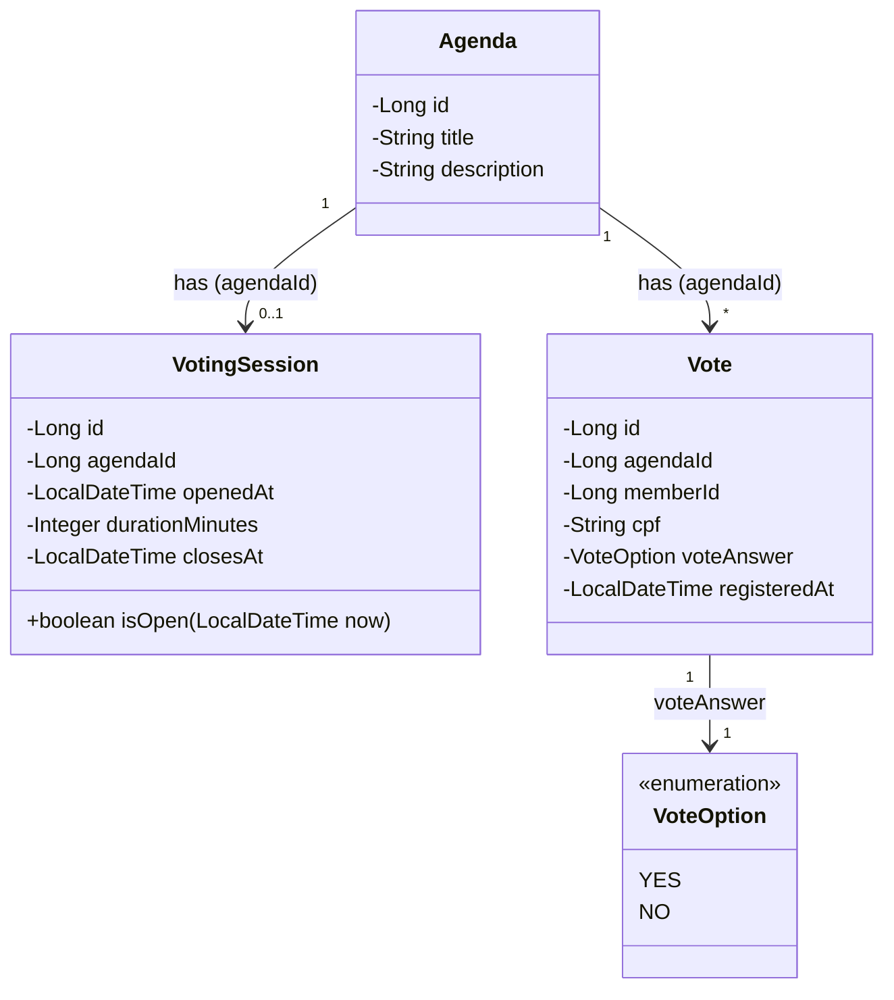

# Diagrama de Classes — Sistema de Votação em Assembleias de Cooperativa

**Projeto:** desafio-votacao-fullstack
**Baseado em:** `docs/01-documento-requisitos.md` (RF01–RF08, RN01–RN08)
**Arquitetura:** pacotes achatados `api / domain / repository / service / infra` (ver `AGENTE_JAVA_SR_PROMPT.md` — para o tamanho deste domínio, uma camada `application/` separada do `service/` seria over engineering)

## 1. Modelo de domínio

As três entidades centrais e o enum de resposta do voto. `Agenda` é o termo em inglês adotado no código já existente (`agendaId`) para "agenda/pauta".

Restrição de negócio (RN01): `Vote` tem **duas** constraints `UNIQUE` no banco — `(agendaId, memberId)` e `(agendaId, cpf)` (migração `V4__add_cpf_unique_to_votes.sql`) — não apenas uma checagem em memória. As duas juntas garantem que nem o `memberId` nem o `cpf` possam ser reutilizados com um contraparte diferente na mesma pauta: um associado que já votou não pode votar de novo com outro `memberId` passando o mesmo `cpf`, e um `cpf` que já votou não pode votar de novo sob um `memberId` diferente. O associado (`memberId`) não é modelado como entidade própria: por decisão de escopo (RN08 do documento de requisitos), o id do associado é apenas recebido pela API, sem cadastro/gestão de associados neste projeto.

## 2. Classes por camada (api · domain · repository · service · infra)

Visão completa incluindo repositórios, serviços, controllers, DTOs e o client fake de validação de CPF (RF06/RN07, tarefa bônus 1).

```mermaid
classDiagram
    %% ---- domain ----
    class Agenda
    class VotingSession
    class Vote
    class VoteOption

    %% ---- repository ----
    class AgendaRepository {
        <<interface>>
        +findById(Long id) Optional~Agenda~
    }
    class VotingSessionRepository {
        <<interface>>
        +findByAgendaId(Long agendaId) Optional~VotingSession~
    }
    class VoteRepository {
        <<interface>>
        +existsByAgendaIdAndMemberId(Long agendaId, Long memberId) boolean
        +existsByAgendaIdAndCpf(Long agendaId, String cpf) boolean
        +countByAgendaIdAndVoteAnswer(Long agendaId, VoteOption option) long
    }

    %% ---- service ----
    class AgendaService {
        -AgendaRepository agendaRepository
        +createAgenda(CreateAgendaRequest request) Agenda
    }
    class VotingSessionService {
        -VotingSessionRepository sessionRepository
        -AgendaRepository agendaRepository
        +openSession(Long agendaId, Integer durationMinutes) VotingSession
        +isSessionOpen(Long agendaId) boolean
    }
    class VoteService {
        -VoteRepository voteRepository
        -VotingSessionService votingSessionService
        -CpfValidationClient cpfValidationClient
        +registerVote(Long agendaId, Long memberId, String cpf, VoteOption answer) Vote
    }
    class VotingResultService {
        -VoteRepository voteRepository
        -VotingSessionService votingSessionService
        +getResult(Long agendaId) VotingResultResponse
    }

    %% ---- infra: client fake de CPF (bônus 1) ----
    class CpfValidationClient {
        <<interface>>
        +checkVotingAbility(String cpf) VotingAbilityResponse
    }
    class FakeCpfValidationClientAdapter {
        +checkVotingAbility(String cpf) VotingAbilityResponse
    }
    class VotingAbilityResponse {
        -VotingAbilityStatus status
    }
    class VotingAbilityStatus {
        <<enumeration>>
        ABLE_TO_VOTE
        UNABLE_TO_VOTE
    }

    %% ---- api: controllers ----
    class AgendaController {
        +create(CreateAgendaRequest) ResponseEntity~AgendaResponse~
    }
    class VotingSessionController {
        +open(Long agendaId, OpenVotingSessionRequest) ResponseEntity~VotingSessionResponse~
    }
    class VoteController {
        +vote(Long agendaId, RegisterVoteRequest) ResponseEntity~VoteResponse~
        +result(Long agendaId) ResponseEntity~VotingResultResponse~
    }

    %% ---- api: exception handling ----
    class GlobalExceptionHandler {
        <<RestControllerAdvice>>
    }
    class AgendaNotFoundException
    class VotingSessionClosedException
    class DuplicateVoteException
    class UnableToVoteException

    %% relações
    AgendaController --> AgendaService
    AgendaService --> AgendaRepository

    VotingSessionController --> VotingSessionService
    VotingSessionService --> VotingSessionRepository
    VotingSessionService --> AgendaRepository

    VoteController --> VoteService
    VoteController --> VotingResultService
    VoteService --> VoteRepository
    VoteService --> VotingSessionService
    VoteService --> CpfValidationClient
    VotingResultService --> VoteRepository
    VotingResultService --> VotingSessionService

    FakeCpfValidationClientAdapter ..|> CpfValidationClient
    FakeCpfValidationClientAdapter --> VotingAbilityResponse
    VotingAbilityResponse --> VotingAbilityStatus

    VoteService ..> DuplicateVoteException : throws
    VoteService ..> VotingSessionClosedException : throws
    VoteService ..> UnableToVoteException : throws
    VotingSessionService ..> AgendaNotFoundException : throws
    GlobalExceptionHandler ..> AgendaNotFoundException : handles
    GlobalExceptionHandler ..> VotingSessionClosedException : handles
    GlobalExceptionHandler ..> DuplicateVoteException : handles
    GlobalExceptionHandler ..> UnableToVoteException : handles
```

## 3. DTOs (application/dto)

Os controllers nunca expõem as entidades diretamente — apenas request/response DTOs (padrão obrigatório do Agente Dev Java Sênior).

| DTO | Direção | Campos |
|---|---|---|
| `CreateAgendaRequest` | request | `title`, `description` |
| `AgendaResponse` | response | `id`, `title`, `description` |
| `OpenVotingSessionRequest` | request | `durationMinutes` (opcional — default 1 min, RN03) |
| `VotingSessionResponse` | response | `id`, `agendaId`, `openedAt`, `closesAt` |
| `RegisterVoteRequest` | request | `memberId`, `cpf`, `voteAnswer` |
| `VoteResponse` | response | `id`, `agendaId`, `memberId`, `voteAnswer`, `registeredAt` |
| `VotingResultResponse` | response | `agendaId`, `totalYes`, `totalNo`, `sessionClosed` |
